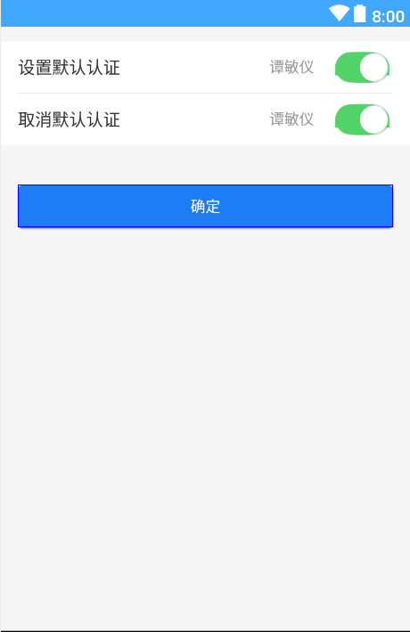
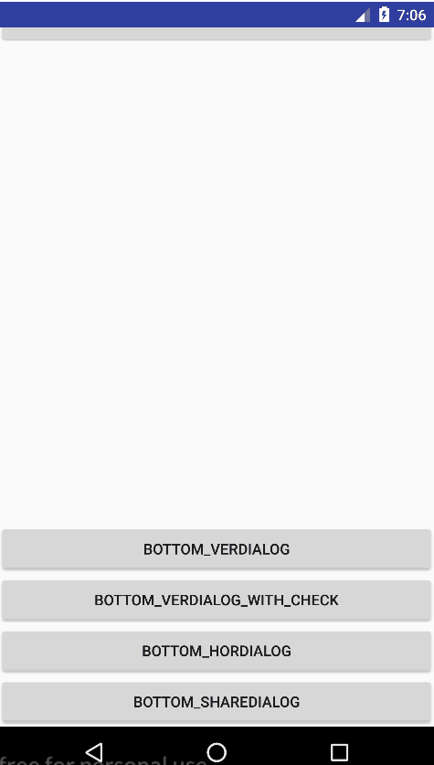

# Base库

`bingo`
个人基础组件库

---

###  一、dialog


```
 //ActionSheet
 new ActionSheetDialog(mContext)
                .setCancelable(false)
                .setCanceledOnTouchOutside(false)
                .setTitle("清空消息列表后，聊天记录依然保留，确定要清空消息列表？")
                .addSheetItem("清空消息列表", Color.parseColor(DEF_RED),
                        new ActionSheetDialog.OnSheetItemClickListener() {
                            @Override
                            public void onClick(int which) {
                                showToast("clear msg list");
                            }
                        })
                .setCancelText("取 消")
                .show();
  //Dialog              
     new AlertDialog(mContext)
                .setCancelable(false)
                .setTitle("退出当前账号")
                .setMessage("再连续登陆15天，就可变身为QQ达人。退出QQ可能会使你现有记录归零，确定退出？")
                .setLeftButton("取消", null)
                .setRightButton("确认退出", new View.OnClickListener() {
                    @Override
                    public void onClick(View v) {
                        showToast("exit");
                    }
                })
                .show();   
        //修改宽度        
       new AlertDialog(mContext)
                .setCancelable(true)
                .setScaleWidth(0.7)// 设置宽度，占屏幕宽度百分比
                .setMessage("你现在无法接收到新消息提醒。请到系统-设置-通知中开启消息提醒")
                .setRightButton("确定", new View.OnClickListener() {
                    @Override
                    public void onClick(View v) {
                        showToast("OK");
                    }
                })
                .show();              
      //EditText
       new AlertEditDialog(mContext)
                .setTitle("姓名")
                .setMessage("请输入您的真实姓名。")
                .setLeftButton("取消", null)
                .setRightButton("确定", new AlertEditDialog.EditTextCallListener() {
                    @Override
                    public void callBack(String str) {
                        showToast(str);
                    }
                })
                .show();
       //wheel
      String[] numbers = new String[]{"北京", "上海", "天津", "杭州", "苏州", "深圳"};
      String defValue = numbers[index];
        new AlertNumberPickerDialog(mContext)
                .setScaleWidth(0.8)
                .setCancelable(false)
                .setTitle("选择城市")
                .setNumberValues(numbers, index, new NumberPicker.OnValueChangeListener() {
                    @Override
                    public void onValueChange(NumberPicker picker, int oldVal, int newVal) {
                        defValue = numbers[newVal];
                    }
                })
                .setNumberValueSuffix("市")
                .setLeftButton("取消", null)
                .setRightButton("确定", new View.OnClickListener() {
                    @Override
                    public void onClick(View v) {
                        showToast(defValue);
                    }
                })
                .show();
```

#### 二、SmartTabLayout


```
布局中使用
	<com.lehand.tablayout.smarttab.SmartTabLayout
        android:id="@+id/viewpagertab"
        android:layout_width="match_parent"
        android:layout_height="48dp"
        android:background="@color/colorPrimary"
        app:stl_defaultTabTextColor="@color/white"
        app:stl_defaultTabTextHorizontalPadding="24dp"
        app:stl_indicatorColor="@color/colorAccent"
        app:stl_indicatorInterpolation="linear"
        app:stl_titleOffset="auto_center"
        app:stl_indicatorThickness="3dp"
        app:stl_underlineThickness="1dp" />
        
     <android.support.v4.view.ViewPager
        android:id="@+id/viewpager"
        android:visibility="visible"
        android:layout_width="match_parent"
        android:layout_height="match_parent" />   
        
代码中使用
       SmartTabLayout mSmartTabLayout = findViewById(R.id.viewpagertab);
       mSmartTabLayout.setCustomTabView(new SmartTabLayout.TabProvider() {
               @Override
               public View createTabView(ViewGroup container, int position, PagerAdapter adapter) {
               	//item 的布局
                    View icon =  LayoutInflater.from(MainActivity.this).inflate(R.layout.custom_tab_icon1, container,
                            false);
                    return icon;
                }
        });
        ViewPager viewPager = (ViewPager) findViewById(R.id.viewpager);
        List<String> titles = new ArrayList<>();
        titles.add("Item 1");
        titles.add("Item 2");
        titles.add("Item 3");
        titles.add("Item 4");
        FragmentPagerItems pages = new FragmentPagerItems(this);
        for (String title : titles) {
            pages.add(FragmentPagerItem.of(title, DemoFragment.class));
        }

        FragmentPagerItemAdapter adapter = new FragmentPagerItemAdapter(
                getSupportFragmentManager(), pages);
        viewPager.setAdapter(adapter);
        mSmartTabLayout.setViewPager(viewPager);
```

#### 三、notify

~~~
 NotifyUtil.buildProgress(102,android.R.drawable.stat_notify_more,"正在下载"+title,progress,100,"下载进度:%dkb/%dkb").show()
~~~

#### 四、gesture


手势库

```
<com.bingo.gesture.GestureLockView
        android:id="@+id/auth_geture_view"
        android:layout_width="300dp"
        android:layout_height="300dp"
        android:layout_gravity="center_horizontal"
        app:error_color="#FF0000"
        app:line_thickness="1dp"
        app:normal_color="#91D5FF"
        app:press_color="#1E8BDE"/>
 //代码
 GestureLockView mGestureLockView = findViewById(R.id.auth_geture_view);
 mGestureLockView.setGestureLockListener(this);        
 ...
   @Override
   public void onComplete(String result) {
        //获取设置的手势
        String defaultPwd = getGesturePwd();
        if (TextUtils.isEmpty(result) || result.length() < 4) {
            Toasting("密码至少4位！");
            mGestureLockView.showErrorStatus(400);
            return;
        } else if (defaultPwd.equals(result)) {
            Toasting("密码正确");
            mGestureLockView.clearView();
            //TODO 
        } else {
            Toasting("密码错误");
            mGestureLockView.showErrorStatus(400);
        }
    }
```

#### 五、refresh-layout

```
 <com.scwang.smartrefresh.layout.SmartRefreshLayout
        android:id="@+id/refreshLayout"
        android:layout_width="match_parent"
        android:layout_height="match_parent">
        ...
</com.scwang.smartrefresh.layout.SmartRefreshLayout>   
//代码
//全局配置头样式
static {
        //启用矢量图兼容
        AppCompatDelegate.setCompatVectorFromResourcesEnabled(true);
        SmartRefreshLayout.setDefaultRefreshHeaderCreator(new DefaultRefreshHeaderCreator() {
            @NonNull
            @Override
            public RefreshHeader createRefreshHeader(@NonNull Context context, @NonNull RefreshLayout layout) {
                //全局设置主题颜色（优先级第二低，可以覆盖 DefaultRefreshInitializer 的配置，与下面的ClassicsHeader绑定）
                layout.setPrimaryColorsId(R.color.gray, android.R.color.white);
                return new ClassicsHeader(context).setTimeFormat(new DynamicTimeFormat("更新于 %s"));
            }
        });
        SmartRefreshLayout.setDefaultRefreshFooterCreator(new DefaultRefreshFooterCreator() {
            @NonNull
            @Override
            public RefreshFooter createRefreshFooter(@NonNull Context context, @NonNull RefreshLayout layout) {
                return new ClassicsFooter(context).setDrawableSize(20);
            }
        });
    }
    
  RefreshLayout refreshLayout = (RefreshLayout)findViewById(R.id.refreshLayout);
  refreshLayout.setOnRefreshListener(new OnRefreshListener() {
          @Override
          public void onRefresh(RefreshLayout refreshlayout) {
               refreshlayout.finishRefresh(2000/*,false*/);//传入false表示刷新失败
           }
      });
  refreshLayout.setOnLoadMoreListener(new OnLoadMoreListener() {
          @Override
          public void onLoadMore(RefreshLayout refreshlayout) {
              refreshlayout.finishLoadMore(2000/*,false*/);//传入false表示加载失败
           }
     });  
```
#### 六、crash库

```
  //设置崩溃异常处理 优于其他操作之前
  //SpiderMan.init(this);//默认是debug模式下的
  SpiderMan.init(this,true);
```

#### 七、badge徽章


```
<com.bingo.ui.BadgeView
    android:layout_width="wrap_content"
    android:layout_height="20dp"
    android:layout_marginLeft="24dp"
    android:gravity="center"
    android:minWidth="20dp"
    android:paddingLeft="4dp"
    android:paddingRight="4dp"
    android:text="123467"
    android:textColor="@color/lib_pub_color_white"
    android:textSize="10dp"
    app:lib_pub_badgev_circle="false" 
    app:lib_pub_badgev_color="@color/lib_pub_color_red"
    app:lib_pub_badgev_radius="6dp" />
 lib_pub_badgev_circle：是否是圆形（默认是圆形）
 lib_pub_badgev_color：徽章背景颜色
 lib_pub_badgev_radius：非圆形时，可设置的边角弧度
```

#### 八、Notice Bar


```
			<com.bingo.ui.NoticeLayout
                android:layout_width="match_parent"
                android:layout_height="40dp"
                android:layout_marginLeft="@dimen/lib_pub_dimen_margin"
                android:layout_marginRight="@dimen/lib_pub_dimen_margin"
                android:layout_marginTop="@dimen/lib_pub_dimen_margin"
                app:lib_pub_noticel_button="@string/module_ui_button"
                app:lib_pub_noticel_exitVisibility="gone"
                app:lib_pub_noticel_gotoVisibility="gone"
                app:lib_pub_noticel_text="@string/module_ui_notice_type3" />
                
 lib_pub_noticel_button：是否显示按钮
 lib_pub_noticel_exitVisibility：是否显示退出
 lib_pub_noticel_gotoVisibility：是否显示可点击箭头
```

#### 八、Popup


```
MenuPopup menuPopup = PopupWindowFactory.createFactory(this)
                    .getMenuPopup(Arrays.asList(new MenuPopup.Bean(getResources().getString(R.string.module_ui_dialog_title) + "1",
                                    R.color.lib_pub_color_text_hint, false),
                            new MenuPopup.Bean(getResources().getString(R.string.module_ui_dialog_title) + "2",
                                    R.color.lib_pub_color_main, false)), new MenuPopup.OnMenuListener() {
       @Override
       public void onClick(PopupWindow popup, int position, String item) {

      }
});
menuPopup.showAsDropDown((View) ViewHelper.findView(this, R.id.iv_title_right/*目标view*/));
```

#### 九、ScrollTab 和SegementView（分段视图）


```
scrollTab
	       <com.bingo.ui.tab.ScrollTab
                android:layout_width="match_parent"
                android:layout_height="40dp"
                android:layout_marginTop="@dimen/lib_pub_dimen_margin"
                android:background="#F9F9F9"
                android:orientation="vertical"
                app:lib_pub_stab_avag="true"
                app:lib_pub_stab_indicatorColor="@color/lib_pub_color_main"
                app:lib_pub_stab_indicatorRadius="0dp"
                app:lib_pub_stab_indicatorType="none"
                app:lib_pub_stab_indicatorWeight="2dp"
                app:lib_pub_stab_indicatorWidth="65dp"
                app:lib_pub_stab_titles="@string/module_ui_labels"
                app:lib_pub_stab_type="view_group" />
          lib_pub_stab_titles:数据集   支持（分号分割）：标签一;标签二;标签三;标签四 
          
SegementView
           <com.bingo.ui.SegementView
                android:layout_width="match_parent"
                android:layout_height="27dp"
                android:layout_marginTop="@dimen/lib_pub_dimen_margin"
                app:lib_pub_segementv_borderWidth="1dp"
                app:lib_pub_segementv_colorMain="@color/lib_pub_color_main"
                app:lib_pub_segementv_colorSub="@color/lib_pub_color_white"
                app:lib_pub_segementv_divideWidth="1dp"
                app:lib_pub_segementv_radius="4dp"
                app:lib_pub_segementv_textSize="@dimen/lib_pub_dimen_text_small"
                app:lib_pub_segementv_titles="@string/module_ui_labelss" />
```

####十、CellView

 

```
 	<com.bingo.ui.CellView
        android:id="@+id/auth_phoneNum"
        android:layout_width="match_parent"
        android:layout_height="wrap_content"
        app:bottom_line="true"
        app:right_image="@drawable/ic_right"
        app:default_switch="true"
        app:type_name="@string/auth_phoneNum" />
        
    right_image:右侧图片
    type_name：类型名称
    type_value:类型值
    bottom_line:是否有下边线
    default_switch：是否有switchButton
    default_normal:普通样式（抬起）的背景颜色
    default_select：按下的背景颜色
    
  default_normal和default_select都设置了并且样式不一样才起效，背景的选择器效果
 //代码设置SwithButton的监听
 CellView cell = findViewById(R.id.auth_phoneNum)
 cell.getSwitchButton().setOnCheckedChangeListener(new SwitchButton.OnCheckedChangeListener() {
            @Override
            public void onCheckedChanged(SwitchButton view, boolean isChecked) {
                Toasting("默认设置 = " + isChecked);
            }
 });
    
```

#### 十一、SlideLayout


```
   <com.bingo.ui.SlideLayout
        android:layout_width="match_parent"
        android:layout_height="wrap_content"
        android:layout_marginBottom="20dp"
        android:layout_marginTop="20dp">

        <com.bingo.ui.CellView
            android:id="@+id/testCrash"
            android:layout_width="match_parent"
            android:layout_height="wrap_content"
            app:type_name="姓名"
            app:type_value="张三" />
        <!--slide view-->
        <LinearLayout
            android:layout_width="wrap_content"
            android:layout_height="match_parent"
            android:orientation="horizontal">

            <TextView
                android:id="@+id/tv_stick"
                android:layout_width="80dp"
                android:layout_height="match_parent"
                android:background="#C7C7CD"
                android:gravity="center"
                android:text="STICK"
                android:textColor="@color/black"
                android:textSize="14dp" />

            <TextView
                android:id="@+id/tv_delete"
                android:layout_width="80dp"
                android:layout_height="match_parent"
                android:background="#FF3A30"
                android:gravity="center"
                android:text="DELETE"
                android:textColor="@color/white"
                android:textSize="14dp" />
        </LinearLayout>
    </com.bingo.ui.SlideLayout>
```

#### 十二、EmptyLayout


```
    <com.bingo.ui.EmptyLayout
        android:id="@+id/emptyLayout"
        android:layout_width="match_parent"
        android:layout_height="match_parent"
        app:lib_pub_content_layout="@layout/layout_main"/>
    //代码
      EmptyLayout emptyLayout = ViewHelper.findView(this,R.id.emptyLayout);
      //设置无网络
      emptyLayout.setState(EmptyLayout.STATE_NET_ERROR);
      emptyLayout.setOnRetryClick(new View.OnClickListener() {
            @Override
            public void onClick(View view) {
                //TODO
            }
        });
       //设置无数据
        emptyLayout.setState(EmptyLayout.STATE_EMPTY);
        //设置显示数据视图
        emptyLayout.setState(EmptyLayout.STATE_CONTENT);
```

#### 十三、SpringView 


```
可回弹组件
代码参考:
 <FrameLayout
        android:layout_width="match_parent"
        android:layout_height="match_parent"
        android:background="#fcfcfc">

        <LinearLayout
            android:layout_width="match_parent"
            android:layout_height="match_parent"
            android:background="#2d3134"
            android:gravity="center_horizontal"
            android:orientation="vertical">
            
            <TextView
                android:layout_width="wrap_content"
                android:layout_height="wrap_content"
                android:layout_marginTop="20dp"
                android:text="页面由腾讯QQ提供"
                android:textColor="#7d7d7d"
                android:textSize="15dp" />

            <TextView
                android:layout_width="wrap_content"
                android:layout_height="wrap_content"
                android:layout_marginTop="5dp"
                android:gravity="center_horizontal"
                android:text="https://github.com/bingolovess/base\n提供技术支持"
                android:textColor="#7d7d7d"
                android:textSize="15dp" />
        </LinearLayout>

        <com.bingo.ui.SpringView
            android:layout_width="match_parent"
            android:layout_height="match_parent"
            app:lib_pub_spring_enable="true"
            app:lib_pub_spring_gravity="top|bottom">

            <android.support.v7.widget.RecyclerView
                android:id="@+id/recycleView"
                android:layout_width="match_parent"
                android:layout_height="match_parent"
                android:background="@color/white" />
        </com.bingo.ui.SpringView>
    </FrameLayout>
```

#### 十四、Dialog （UI库里的）


```
 private void getLoading() {
        final AlertDialog loadingDialog = AlertDialogFactory.createFactory(this).getLoadingDialog();
        new Handler().postDelayed(new Runnable() {
            @Override
            public void run() {
                loadingDialog.dismiss();
            }
        }, 2000);
    }

    private void getAlertDialog() {
        AlertDialogFactory.createFactory(this).getAlertDialog("标题",
                "内容",
                "OK", null,
                new AlertDialogFactory.OnClickListener() {
                    @Override
                    public void onClick(AlertDialog dlg, View v) {

                    }
                }, null);
    }

    private void getEditDialog() {
        AlertDialogFactory.createFactory(this).getEditDialog("EditText"
                , "", new EditDialog.OnEditListener() {
                    @Override
                    public void onSubmit(Dialog dlg, String content) {

                    }

                    @Override
                    public void onCancel(Dialog dlg) {

                    }
                });
    }

    private void getAlertSubDialog() {
        AlertDialogFactory.createFactory(this).getAlertSubDialog("标题",
                "内容",
                "提示tip",
                true, new AlertSubDialog.OnCheckListener() {
                    @Override
                    public void onSubmit(Dialog dlg, boolean isChecked) {

                    }

                    @Override
                    public void onCancel(Dialog dlg) {

                    }
                });
    }

    private void getInfoDialog() {
        AlertDialogFactory.createFactory(this).getInfoDialog("标题",
                Arrays.asList(new InfoDialog.Bean("小标题1", "" + 1111111),
                        new InfoDialog.Bean("小标题2", "" + 2222222),
                        new InfoDialog.Bean("小标题3", "" + 3333333),
                        new InfoDialog.Bean("小标题4", "" + 4444444),
                        new InfoDialog.Bean("小标题5", "" + 5555555)));
    }

    private void getOptionDialog() {
        AlertDialogFactory.createFactory(this).getOperationDialog("标题",
                Arrays.asList(new OperationDialog.Bean("item1", R.color.lib_pub_color_main, false),
                        new OperationDialog.Bean("item2", R.color.lib_pub_color_main, false)),
                new AbsSheetDialog.OnItemClickListener() {
                    @Override
                    public void onClick(Dialog dlg, int position, Object item) {

                    }

                    @Override
                    public void onCancel(Dialog dlg) {

                    }
                });
    }

```


```
 private void getBottomVerDialog() {
        AlertDialogFactory.createFactory(this).getBottomVerDialog("标题",
                Arrays.asList(new BottomVerSheetDialog.Bean("item1", R.color.lib_pub_color_text_main, false),
                        new BottomVerSheetDialog.Bean("item2", R.color.lib_pub_color_text_main, false),
                        new BottomVerSheetDialog.Bean("item3", R.color.lib_pub_color_text_main, false),
                        new BottomVerSheetDialog.Bean("item4", R.color.lib_pub_color_red, false),
                        new BottomVerSheetDialog.Bean("item5", R.color.lib_pub_color_text_hint, false)),
                new AbsSheetDialog.OnItemClickListener<BottomVerSheetDialog.Bean>() {
                    @Override
                    public void onClick(Dialog dlg, int position, BottomVerSheetDialog.Bean item) {

                    }

                    @Override
                    public void onCancel(Dialog dlg) {

                    }
                });
    }

    private void getBottomVerDialogWithCheck() {
        AlertDialogFactory.createFactory(this).getBottomVerDialog("标题",
                Arrays.asList(new BottomVerSheetDialog.Bean("item1", R.color.lib_pub_color_text_main, true),
                        new BottomVerSheetDialog.Bean("item2", R.color.lib_pub_color_text_main, false),
                        new BottomVerSheetDialog.Bean("item3", R.color.lib_pub_color_text_main, false),
                        new BottomVerSheetDialog.Bean("item4", R.color.lib_pub_color_red, false),
                        new BottomVerSheetDialog.Bean("item5", R.color.lib_pub_color_text_hint, false)),
                new AbsSheetDialog.OnItemClickListener<BottomVerSheetDialog.Bean>() {
                    @Override
                    public void onClick(Dialog dlg, int position, BottomVerSheetDialog.Bean item) {
                        item.isChecked = true;
                    }

                    @Override
                    public void onCancel(Dialog dlg) {

                    }
                });
    }

    private void getBottomHorDialog() {
        AlertDialogFactory.createFactory(this).getBottomHorDialog("分享",
                Arrays.asList(new BottomHorSheetDialog.Bean("QQ", R.drawable.lib_pub_ic_btb_icon),
                        new BottomHorSheetDialog.Bean("微信", R.drawable.lib_pub_ic_btb_icon),
                        new BottomHorSheetDialog.Bean("新浪", R.drawable.lib_pub_ic_btb_icon),
                        new BottomHorSheetDialog.Bean("微博", R.drawable.lib_pub_ic_btb_icon),
                        new BottomHorSheetDialog.Bean("短信", R.drawable.lib_pub_ic_btb_icon)),
                new AbsSheetDialog.OnItemClickListener<BottomHorSheetDialog.Bean>() {
                    @Override
                    public void onClick(Dialog dlg, int position, BottomHorSheetDialog.Bean item) {

                    }

                    @Override
                    public void onCancel(Dialog dlg) {

                    }
                });
    }

    private void getBottomShareDialog() {
        AlertDialogFactory.createFactory(this)
                .getBottomShareDialog("分享",
                        Arrays.asList(new BottomShareSheetDialog.Bean("链接地址", "https://www.baidu.com/link?url=eZH1yw2u1h-CNrpm7Q3jD_EfVnUxwUuBHlTGhLlA_KfhwtG0TGSl4a7kPsJNMqE8&wd=&eqid=f50ccdfc00009400000000065b232f14"),
                                new BottomShareSheetDialog.Bean("提取密码", "3854", false)),
                        new BottomShareSheetDialog.SwithCheckListener() {
                            @Override
                            public void onCheckedChanged(boolean checked, BottomShareSheetDialog dialog) {
                                if (checked) {
                                    ToastUtils.show(ViewTestActivity.this, "打开");
                                } else {
                                    ToastUtils.show(ViewTestActivity.this, "关闭");
                                }
                                dialog.dismiss();
                            }
                        }
                );
    }
```